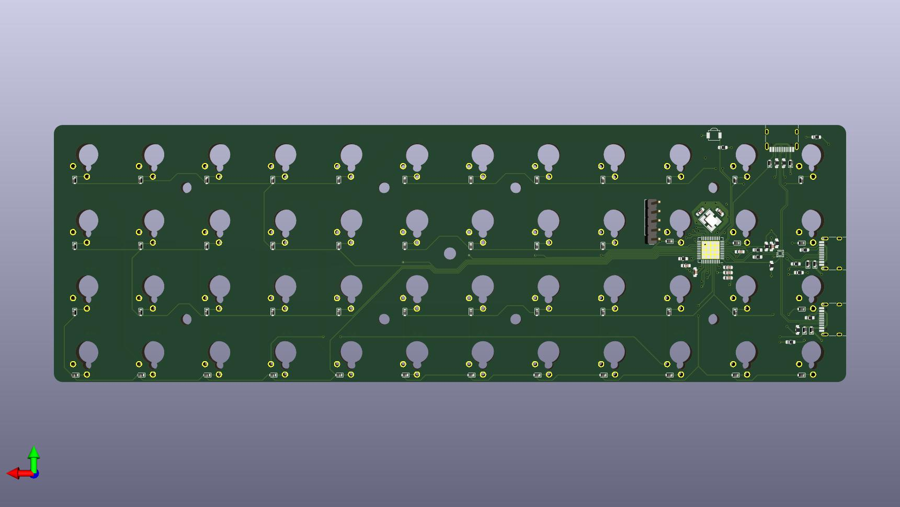
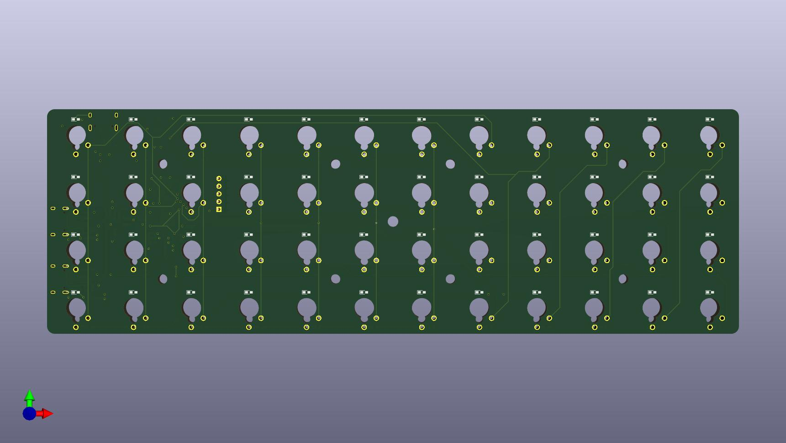
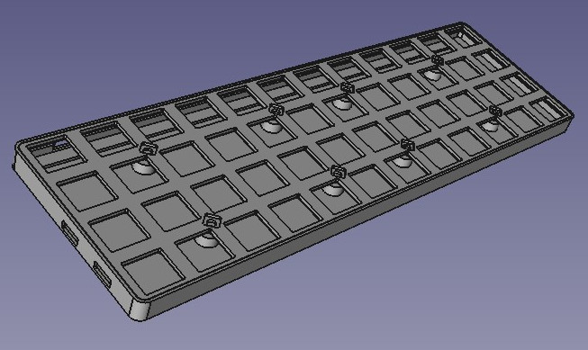

# derb-planck

DIY mechanical keyboard which can be connected to several hosts at the same time.
[See blog post for more details.](https://der-b.com/posts/2024-05-08-mechanical-keyboard-derb-planck/)

## PCB

The PCB is designed with KiCad and is located in the subdirectory "PCB".

## Case

The Case is designed with FreeCAD and is located in the subdirectory "case".

## Firmeware

[This keyboard uses QMK as firmware.](https://github.com/der-b/qmk_firmware/tree/derb_planck/keyboards/handwired/derb_planck)
